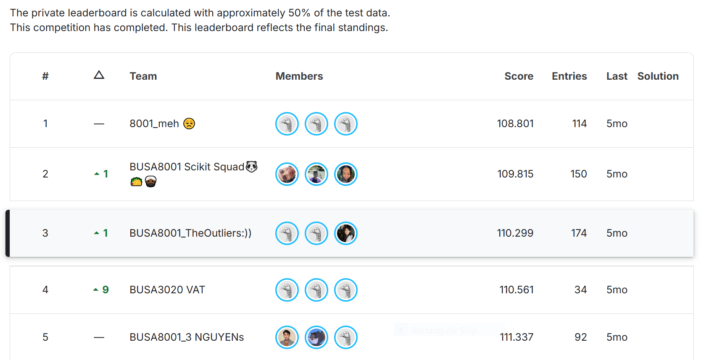

# Airbnb Melbourne Price Prediction

## 📌 Project Overview
This project focuses on building a **machine learning model to predict the price of Airbnb listings in Melbourne** based on property and host features.
The model was trained on historical data and applied to unseen listings, with the aim of achieving high predictive accuracy.

### Business Relevance (Stakeholders)
- **Hosts**: Set competitive, data-driven prices and avoid revenue loss from underpricing or booking loss from overpricing
- **Guests**: Compare predicted fair prices against listings to make better booking decisions
- **Platforms**: Enhance pricing systems with more transparent, accurate, and explainable algorithms

## 📂 Dataset
The project was built on structured Airbnb listing data provided in two files:
- **train.csv**: 7,000 rows × 61 columns (includes target variable: `price`)
- **test.csv**: 3,000 rows × 60 columns (excludes target variable: `price`)

---

## 🔎 Project Workflow

### 1. Exploratory Data Analysis (EDA)
`Part 1_EDA.ipynb`

- Explored property, host, and location features to understand data distribution
- Identified outliers and highlighted correlations between variables and price
- Built early insights into which factors (e.g., location, amenities, host behavior) drive price differences

  
### 2. Data Processing & Feature Engineering 
`Part 2_Data Processing.ipynb`

The dataset contained inconsistent formats, missing values, and categorical variables with many rare categories
To prepare it for predictive modeling, this part focused on:
- **Standardization**: Converting messy numerical and text data (e.g., prices, response rates, bathroom counts) into structured numeric formats
- **Missing value strategies**: Applying context-driven imputation for text, categorical, and numerical features to preserve dataset integrity
- **Feature engineering**: Transforming complex attributes (amenities, neighbourhoods, property types) into interpretable features that capture real business meaning
- **Noise reduction**: Grouping rare categories into "Other" to simplify models and improve generalization

**Why this matters**: A strong data pipeline ensures the model learns from **reliable, consistent, and business-relevant variables**, which has a greater impact on accuracy than algorithm choice alone.

### 3. Predictive Modeling
`Part 3_Predicting.ipynb`
- Trained four predictive models: **Ridge, Lasso, SVR, and LightGBM**
- Built a **stacked ensemble** combining these models to reduce error and capture complementary strengths
- Used **Optuna** for hyperparameter tuning, balancing accuracy with generalization

---

## 🏆 Results

- **Final Ranking**: Top 3 out of 106 competitors
- **Private Leaderboard Score**: **110.299** (predictions within ~110 AUD of actual prices on average)
- **Result Recorded**: 6 June 2025, 1:57 PM (AEST)
- **Leaderboard Reference**: [View on Kaggle](https://www.kaggle.com/competitions/asba-predictive-analytics-competition/leaderboard)

---

## 💡 Key Takeaways

- **Data quality is the driver of performance**: Well-structured inputs had a bigger impact than complex models
- **Generalizable pipeline**: The feature engineering and cleaning framework can be applied to other pricing or recommendation problems
- **Exposure to ML**: Built and tuned predictive models to demonstrate how clean data enables stronger outcomes

---
